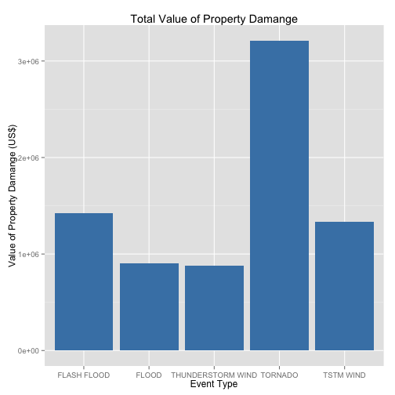

Reproducible Research: Peer Assesment 2
=========================================
Created by ZeroStack

## The Impact of Severe Weather on Public Health and Economic Prosperity in the United States

### Synopsis
Severe weather events can impact both public health and economic prosperity. This includes the likes of fatalaties, injuries, and property damage. In this report, we will explore data collected from the U.S. National Oceanic and Atmospheric Administration storm database to determine which types of events have the most significant impact on population health and which have the greatest economic consequences.  

### Data
The data can be obtained [https://d396qusza40orc.cloudfront.net/repdata%2Fdata%2FStormData.csv.bz2](https://d396qusza40orc.cloudfront.net/repdata%2Fdata%2FStormData.csv.bz2)

# Settings

```r
echo=TRUE
```


```r
data <- read.csv("repdata-data-StormData.csv")
```
Data Dimensions General Info

```r
dim(data)
```

```
## [1] 902297     37
```

```r
head(data)
```

```
##   STATE__           BGN_DATE BGN_TIME TIME_ZONE COUNTY COUNTYNAME STATE
## 1       1  4/18/1950 0:00:00     0130       CST     97     MOBILE    AL
## 2       1  4/18/1950 0:00:00     0145       CST      3    BALDWIN    AL
## 3       1  2/20/1951 0:00:00     1600       CST     57    FAYETTE    AL
## 4       1   6/8/1951 0:00:00     0900       CST     89    MADISON    AL
## 5       1 11/15/1951 0:00:00     1500       CST     43    CULLMAN    AL
## 6       1 11/15/1951 0:00:00     2000       CST     77 LAUDERDALE    AL
##    EVTYPE BGN_RANGE BGN_AZI BGN_LOCATI END_DATE END_TIME COUNTY_END
## 1 TORNADO         0                                               0
## 2 TORNADO         0                                               0
## 3 TORNADO         0                                               0
## 4 TORNADO         0                                               0
## 5 TORNADO         0                                               0
## 6 TORNADO         0                                               0
##   COUNTYENDN END_RANGE END_AZI END_LOCATI LENGTH WIDTH F MAG FATALITIES
## 1         NA         0                      14.0   100 3   0          0
## 2         NA         0                       2.0   150 2   0          0
## 3         NA         0                       0.1   123 2   0          0
## 4         NA         0                       0.0   100 2   0          0
## 5         NA         0                       0.0   150 2   0          0
## 6         NA         0                       1.5   177 2   0          0
##   INJURIES PROPDMG PROPDMGEXP CROPDMG CROPDMGEXP WFO STATEOFFIC ZONENAMES
## 1       15    25.0          K       0                                    
## 2        0     2.5          K       0                                    
## 3        2    25.0          K       0                                    
## 4        2     2.5          K       0                                    
## 5        2     2.5          K       0                                    
## 6        6     2.5          K       0                                    
##   LATITUDE LONGITUDE LATITUDE_E LONGITUDE_ REMARKS REFNUM
## 1     3040      8812       3051       8806              1
## 2     3042      8755          0          0              2
## 3     3340      8742          0          0              3
## 4     3458      8626          0          0              4
## 5     3412      8642          0          0              5
## 6     3450      8748          0          0              6
```

### Data Processing
Since we are only interested in event types with respect to health and economic implications; we can filter and select only relevant variables in line with our objective. And then summarise the data by event type.


```r
library(dplyr, quietly = TRUE)
data <- select(data, EVTYPE, FATALITIES, INJURIES, PROPDMG, PROPDMGEXP, CROPDMG) %>% group_by(EVTYPE) %>% summarise_each(funs(sum)) %>%ungroup() %>% arrange(desc(FATALITIES, desc(INJURIES), desc(PROPDMG), desc(PROPDMGEXP), desc(CROPDMG)))
```

Our data is now as so:

```r
dim(data)
```

```
## [1] 985   6
```

```r
head(data)
```

```
## Source: local data frame [6 x 6]
## 
##           EVTYPE FATALITIES INJURIES   PROPDMG PROPDMGEXP   CROPDMG
## 1        TORNADO       5633    91346 3212258.2     898934 100018.52
## 2 EXCESSIVE HEAT       1903     6525    1460.0      13298    494.40
## 3    FLASH FLOOD        978     1777 1420124.6     584451 179200.46
## 4           HEAT        937     2100     298.5      10817    662.70
## 5      LIGHTNING        816     5230  603351.8     191710   3580.61
## 6      TSTM WIND        504     6957 1335965.6    1226522 109202.60
```

### Results
Load plotting libraries

```r
library(ggplot2)
```

Across the United States, which types of events (as indicated in the EVTYPE variable) are most harmful with respect to population health?

```r
# Select and Arrange by Fatalities and Injuries
data.fat <- select(data, EVTYPE, FATALITIES, INJURIES) %>% arrange(desc(FATALITIES))
data.fat <- dat.fat[1:5,]
```

```
## Error in eval(expr, envir, enclos): object 'dat.fat' not found
```

```r
data.inj <- select(data, EVTYPE, FATALITIES, INJURIES) %>% arrange(desc(INJURIES))
data.inj <- data.inj[1:5,]
# Plot Fatalities
ggplot(data.fat[1:5,], aes(x = EVTYPE, y = FATALITIES)) + geom_bar(fill = "steelblue", stat = "identity") + xlab("Event Type") + 
    ylab("Number of Fatalities") + ggtitle("Total number of Fatalities")
```

 

```r
# Plot Injuries
ggplot(data.inj[1:5,], aes(x = EVTYPE, y = INJURIES)) + geom_bar(fill = "steelblue", stat = "identity") + xlab("Event Type") + 
    ylab("Number of injuries") + ggtitle("Total number of Injuries")
```

 


Across the United States, which types of events have the greatest economic consequences?

```r
# Select and Arrange by PROPDMG and CROPDMG
data.two <- select(data, EVTYPE, PROPDMG, CROPDMG) %>% arrange(desc(PROPDMG), desc(CROPDMG))
data.pro <- select(data.two, EVTYPE, PROPDMG, CROPDMG) %>% arrange(desc(PROPDMG))
data.pro <- data.pro[1:5,]
data.cro <- select(data.two, EVTYPE, PROPDMG, CROPDMG) %>% arrange(desc(CROPDMG))
data.cro <- data.cro[1:5,]
ggplot(data.pro, aes(x = EVTYPE, y = PROPDMG)) + geom_bar(fill = "steelblue", stat = "identity") + ggtitle("Total Value of Property Damange") + xlab("Event Type") + ylab("Value of Property Damange (US$)")
```

 

### Conclusion
From the data and visualisations it is clear that Tornados and Excessive Heat cause the most damage to public health.

Tornados and Flash Floods cause the most damange to property damange which is a gauge of economic impact.


